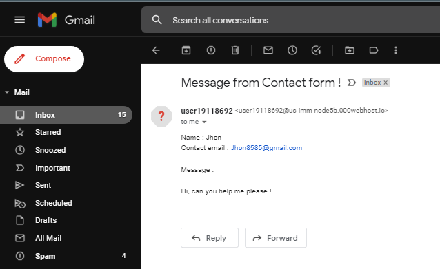

# Html-Contact-form
This is an example of a webpage contact form using html, css and php, also send form  contents via email. 
The page work on both mobile web browser & desktop.
 
 

## 🚀 Getting started

* Get the source [code](https://github.com/Abhijeetbyte/Html-Contact-form/archive/refs/heads/main.zip)

* Extract the zip and uploade the website on your hosting server
  - Here i am using **000webhost.com** it's free and allow sending emails too.

* Change receiving email address 

  - 
 

### Webpage 

 

* As soon as someone fill the form and click on **Send** button, you will receive an email 

  - 
